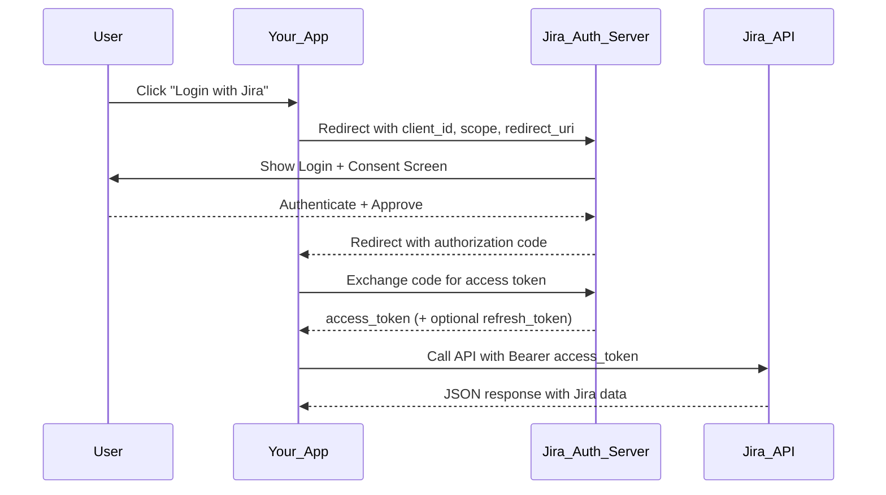
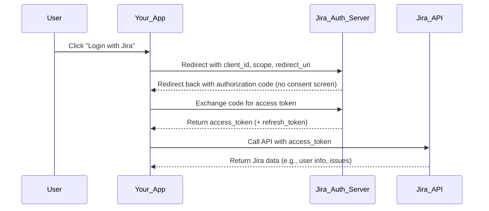
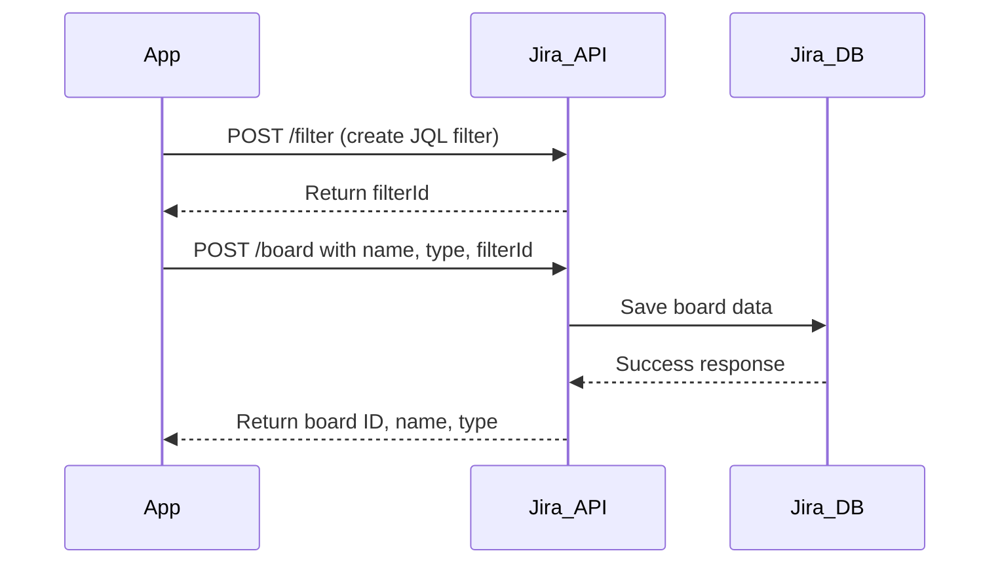

# mermaid

##  Jira OAuth 2.0 Flow

```mermaid
sequenceDiagram
    participant User
    participant Your_App
    participant Jira_Auth_Server
    participant Jira_API

    User->>Your_App: Click "Login with Jira"
    Your_App->>Jira_Auth_Server: Redirect with client_id, scope, redirect_uri
    Jira_Auth_Server->>User: Show Login + Consent Screen
    User-->>Jira_Auth_Server: Authenticate + Approve
    Jira_Auth_Server-->>Your_App: Redirect with authorization code
    Your_App->>Jira_Auth_Server: Exchange code for access token
    Jira_Auth_Server-->>Your_App: access_token (+ optional refresh_token)
    Your_App->>Jira_API: Call API with Bearer access_token
    Jira_API-->>Your_App: JSON response with Jira data
```
## Jira OAuth 2.0 Flow 

```mermaid
sequenceDiagram
    participant User
    participant Your_App
    participant Jira_Auth_Server
    participant Jira_API

    User->>Your_App: Click "Login with Jira"
    Your_App->>Jira_Auth_Server: Redirect with client_id, scope, redirect_uri
    Jira_Auth_Server-->>Your_App: Redirect back with authorization code (no consent screen)
    Your_App->>Jira_Auth_Server: Exchange code for access token
    Jira_Auth_Server-->>Your_App: Return access_token (+ refresh_token)
    Your_App->>Jira_API: Call API with access_token
    Jira_API-->>Your_App: Return Jira data (e.g., user info, issues)
```

``` mermaid
sequenceDiagram
    participant App
    participant Jira_API
    participant Jira_DB

    App->>Jira_API: POST /filter (create JQL filter)
    Jira_API-->>App: Return filterId

    App->>Jira_API: POST /board with name, type, filterId
    Jira_API->>Jira_DB: Save board data
    Jira_DB-->>Jira_API: Success response
    Jira_API-->>App: Return board ID, name, type

```
